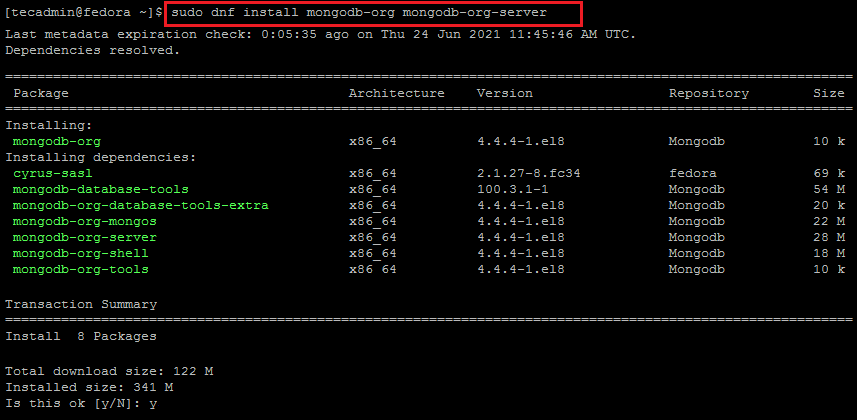
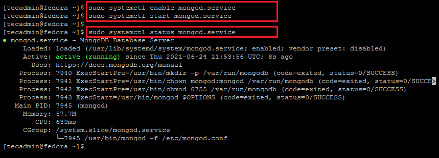

<a href = "#ubuntu"> Ubuntu </a> <a href ="#fedora">Fedora</a>

Para ter uma instalação melhor com a versão mais recenete, entre no site oficial do <a href = "https://docs.mongodb.com/manual/tutorial/install-mongodb-on-ubuntu/">MongoDB</a> para instalar a versão mais recente para o Ubuntu ou Fedora.

#### Obs: MongoDB Atlas

[MongoDB Atlas](https://www.mongodb.com/cloud/atlas?tck=docs_server) é uma opção de serviço MongoDB hospedado na nuvem que não requer sobrecarga de instalação e oferece um nível gratuito para começar.


<p id = "ubuntu">


# Instalando o MongoDB Community Edition no Ubuntu

## Visão geral 

Use este tutorial para instalar o MongoDB 5.0 Community Edition em versões LTS (suporte de longo prazo) do Ubuntu Linux usando o `apt` gerenciador de pacotes.

O MongoDB 5.0 Community Edition oferece suporte às seguintes versões do Ubuntu LTS de **64 bits** (suporte de longo prazo) na arquitetura [x86_64](https://docs.mongodb.com/manual/administration/production-notes/#std-label-prod-notes-supported-platforms-x86_64) :

- 20.04 LTS ("Focal")
- 18.04 LTS ("Biônico")
- 16.04 LTS ("Xenial")

O MongoDB suporta apenas as versões de 64 bits dessas plataformas.

O MongoDB 5.0 Community Edition no Ubuntu também suporta a arquitetura [ARM64](https://docs.mongodb.com/manual/administration/production-notes/#std-label-prod-notes-supported-platforms-ARM64) em plataformas selecionadas.

Consulte [Plataformas com suporte](https://docs.mongodb.com/manual/administration/production-notes/#std-label-prod-notes-supported-platforms) para obter mais informações.

### Pacotes oficiais do MongoDB 

Para instalar a comunidade MongoDB em seu sistema Ubuntu, essas instruções usarão o `mongodb-org` pacote oficial, que é mantido e suportado pela MongoDB Inc. O `mongodb-org` pacote oficial sempre contém a versão mais recente do MongoDB e está disponível em seu próprio repositório dedicado.

#### Importante

O `mongodb` pacote fornecido pelo Ubuntu **não** é mantido pela MongoDB Inc. e está em conflito com o pacote oficial `mongodb-org`. Se você já instalou o pacote `mongodb` em seu sistema Ubuntu , você **deve** primeiro desinstalar o pacote `mongodb` antes de prosseguir com estas instruções .

Consulte [MongoDB Community Edition Packages](https://docs.mongodb.com/manual/tutorial/install-mongodb-on-ubuntu/#std-label-ubuntu-package-content) para obter a lista completa dos pacotes oficiais.

## Instale o MongoDB Community Edition 

Siga estas etapas para instalar o MongoDB Community Edition usando o gerenciador de pacotes `apt`.

#### `1` Importe a chave pública usada pelo sistema de gerenciamento de pacotes.

Em um terminal, emita o seguinte comando para importar a chave GPG pública do MongoDB de https://www.mongodb.org/static/pgp/server-5.0.asc :

```bash
wget -qO - https://www.mongodb.org/static/pgp/server-5.0.asc | sudo apt-key add -
```

A operação deve responder com um `OK`.

No entanto, se receber um erro indicando que `gnupg` não está instalado, tente o seguinte:

 1. Instale `gnupg` e suas bibliotecas necessárias usando o seguinte comando:

    ```bash
    sudo apt-get install gnupg
    ```

 2. Depois de instalado, tente importar a chave novamente:

    ```bash
    wget -qO - https://www.mongodb.org/static/pgp/server-5.0.asc | sudo apt-key add -
    ```

#### `2` Crie um arquivo de lista para MongoDB.

Crie o arquivo de lista `/etc/apt/sources.list.d/mongodb-org-5.0.list` para sua versão do Ubuntu.

Clique na guia apropriada para sua versão do Ubuntu. Se você não tiver certeza de qual versão do Ubuntu o host está executando, abra um terminal ou shell no host e execute `lsb_release -dc`.

| Ubuntu 20.04 (Focal)                                         | Ubuntu 18.04 (Bionic)                                        | **Ubuntu 16.04 (Xenial)**                                    |
| :----------------------------------------------------------- | :----------------------------------------------------------- | :----------------------------------------------------------- |
| Crie o `/etc/apt/sources.list.d/mongodb-org-5.0.list` arquivo para Ubuntu 20.04 (Focal): | Crie o `/etc/apt/sources.list.d/mongodb-org-5.0.list` arquivo para Ubuntu 18.04 (Bionic): | Crie o `/etc/apt/sources.list.d/mongodb-org-5.0.list` arquivo para Ubuntu 16.04 (Xenial): |
| echo "deb [ arch=amd64,arm64 ] https://repo.mongodb.org/apt/ubuntu focal/mongodb-org/5.0 multiverse" | echo "deb [ arch=amd64,arm64 ] https://repo.mongodb.org/apt/ubuntu bionic/mongodb-org/5.0 multiverse" | echo "deb [ arch=amd64,arm64 ] https://repo.mongodb.org/apt/ubuntu xenial/mongodb-org/5.0 multiverse" |

#### `3` Recarregue o banco de dados do pacote local.

Emita o seguinte comando para recarregar o banco de dados do pacote local:

```bash
sudo apt-get update
```

#### `4` Instale os pacotes MongoDB.

Você pode instalar a versão estável mais recente do MongoDB ou uma versão específica do MongoDB.

| Instale a versão mais recente do MongoDB                     | Instale uma versão específica do MongoDB                     |
| :----------------------------------------------------------- | :----------------------------------------------------------- |
| Para instalar a versão estável mais recente, emita o seguinte | Para instalar uma versão específica, você deve especificar cada pacote de componente individualmente junto com o número da versão, como no exemplo a seguir: |
| sudo apt-get install -y mongodb-org                          | sudo apt-get install -y mongodb-org=5.0.2 mongodb-org-database=5.0.2 mongodb-org-server=5.0.2 mongodb-org-shell=5.0.2 mongodb-org-mongos=5.0.2 mongodb-org-tools=5.0.2 |
|                                                              | Se você apenas instalar `mongodb-org=5.0.2` e não incluir os pacotes de componentes, a versão mais recente de cada pacote MongoDB será instalada independentemente da versão que você especificou. |

Opcional. Embora você possa especificar qualquer versão disponível do MongoDB, `apt-get` atualizará os pacotes quando uma versão mais nova estiver disponível. Para evitar atualizações não intencionais, você pode fixar o pacote na versão atualmente instalada:

```bash
echo "mongodb-org hold" | sudo dpkg --set-selections
echo "mongodb-org-database hold" | sudo dpkg --set-selections
echo "mongodb-org-server hold" | sudo dpkg --set-selections
echo "mongodb-org-shell hold" | sudo dpkg --set-selections
echo "mongodb-org-mongos hold" | sudo dpkg --set-selections
echo "mongodb-org-tools hold" | sudo dpkg --set-selections
```

Para obter ajuda com a solução de erros encontrados durante a instalação do MongoDB no Ubuntu, consulte nosso guia de [solução de problemas](https://docs.mongodb.com/manual/reference/installation-ubuntu-community-troubleshooting/#std-label-install-ubuntu-troubleshooting).

## Execute o MongoDB Community Edition

#### Considerações sobre ulimit

A maioria dos sistemas operacionais do tipo Unix limita os recursos do sistema que um processo pode usar. Esses limites podem impactar negativamente a operação do MongoDB e devem ser ajustados. Consulte [Configurações do ](https://docs.mongodb.com/manual/reference/ulimit/)[UNIX `ulimit`](https://docs.mongodb.com/manual/reference/ulimit/) para obter as configurações recomendadas para sua plataforma.

#### Observação

A partir do MongoDB 4.4, um erro de inicialização será gerado se o `ulimit` valor para o número de arquivos abertos estiver abaixo de `64000`.

### Diretórios

Se você instalou por meio do gerenciador de pacotes, o diretório de dados `/var/lib/mongodb`e o diretório de log `/var/log/mongodb`são criados durante a instalação.Por padrão, o MongoDB é executado usando a `mongodb`conta do usuário. Se você alterar o usuário que executa o processo MongoDB, também **deverá** modificar a permissão para os diretórios de dados e log para fornecer a esse usuário acesso a esses diretórios.

### Arquivo de configuração

O pacote oficial do MongoDB inclui um [arquivo de configuração](https://docs.mongodb.com/manual/reference/configuration-options/#std-label-conf-file) ( `/etc/mongod.conf`). Essas configurações (como o diretório de dados e as especificações do diretório de log) entram em vigor na inicialização. Ou seja, se você alterar o arquivo de configuração enquanto a instância do MongoDB estiver em execução, deverá reiniciar a instância para que as alterações tenham efeito.

### Procedimento 

Siga estas etapas para executar o MongoDB Community Edition em seu sistema. Estas instruções assumem que você está usando o `mongodb-org` pacote oficial - não o `mongodb` pacote não oficial fornecido pelo Ubuntu e está usando as configurações padrão.

**Init System**

Para executar e gerenciar seu [`mongod`](https://docs.mongodb.com/manual/reference/program/mongod/#mongodb-binary-bin.mongod) processo, você usará o sistema [init](https://docs.mongodb.com/manual/reference/glossary/#std-term-init-system) integrado de seu sistema operacional. As versões recentes do Linux tendem a usar o **systemd** (que usa o `systemctl` comando), enquanto as versões mais antigas do Linux tendem a usar o **init do System V** (que usa o `service` comando).

Se você não tiver certeza de qual sistema init sua plataforma usa, execute o seguinte comando:

```bash
ps --no-headers -o comm 1
```

Em seguida, selecione a guia apropriada abaixo com base no resultado:

- `systemd` - selecione a guia **systemd (systemctl)** abaixo.
- `init` - selecione a guia **System V Init (serviço)** abaixo.

### systemd (systemctl)

#### `1` Inicie o MongoDB

Você pode iniciar o [`mongod`](https://docs.mongodb.com/manual/reference/program/mongod/#mongodb-binary-bin.mongod) processo emitindo o seguinte comando:

```bash
sudo systemctl start mongod
```

Se você receber um erro semelhante ao seguinte ao iniciar [`mongod`](https://docs.mongodb.com/manual/reference/program/mongod/#mongodb-binary-bin.mongod):

```bash
Failed to start mongod.service: Unit mongod.service not found.
```

Execute o seguinte comando primeiro:

```bash
sudo systemctl daemon-reload
```

Em seguida, execute o comando start acima novamente.

#### `2` Verifique se o MongoDB foi iniciado com sucesso.

```bash
sudo systemctl status mongod
```

Você pode opcionalmente garantir que o MongoDB iniciará após uma reinicialização do sistema, emitindo o seguinte comando:

```bash
sudo systemctl enable mongod
```

#### `3` Pare o MongoDB.

Conforme necessário, você pode interromper o [`mongod`](https://docs.mongodb.com/manual/reference/program/mongod/#mongodb-binary-bin.mongod) processo emitindo o seguinte comando:

```bash
sudo systemctl stop mongod
```

#### `4` Reinicie o MongoDB.

Você pode reiniciar o [`mongod`](https://docs.mongodb.com/manual/reference/program/mongod/#mongodb-binary-bin.mongod) processo emitindo o seguinte comando:

```bash
sudo systemctl restart mongod
```

Você pode acompanhar o estado do processo em busca de erros ou mensagens importantes, observando a saída no `/var/log/mongodb/mongod.log` arquivo.

#### `5` Comece a usar o MongoDB.

Inicie uma [`mongosh`](https://docs.mongodb.com/mongodb-shell/#mongodb-binary-bin.mongosh) sessão na mesma máquina host que o [`mongod`](https://docs.mongodb.com/manual/reference/program/mongod/#mongodb-binary-bin.mongod). Você pode executar [`mongosh`](https://docs.mongodb.com/mongodb-shell/#mongodb-binary-bin.mongosh) sem nenhuma opção de linha de comando para se conectar a um [`mongod`](https://docs.mongodb.com/manual/reference/program/mongod/#mongodb-binary-bin.mongod) que está sendo executado em seu localhost com a porta padrão 27017.

```bash
mongosh
```

Para obter mais informações sobre como conectar usando [`mongosh`](https://docs.mongodb.com/mongodb-shell/#mongodb-binary-bin.mongosh), como conectar-se a uma [`mongod`](https://docs.mongodb.com/manual/reference/program/mongod/#mongodb-binary-bin.mongod) instância em execução em um host e / ou porta diferente, consulte a [documentação](https://docs.mongodb.com/mongodb-shell/) do [mongosh](https://docs.mongodb.com/mongodb-shell/) .

Para ajudá-lo a começar a usar o MongoDB, o MongoDB fornece [guias de primeiros passos](https://docs.mongodb.com/manual/tutorial/getting-started/#std-label-getting-started) em várias edições de driver. Para obter a documentação do driver, consulte [Começar a desenvolver com MongoDB](https://api.mongodb.com/)

### System V Init (serviço)

### `1` Inicie o MongoDB. 

Emita o seguinte comando para iniciar [`mongod`](https://docs.mongodb.com/manual/reference/program/mongod/#mongodb-binary-bin.mongod):

```bash
sudo service mongod start
```

#### `2` Verifique se o MongoDB foi iniciado com sucesso 

Verifique se o [`mongod`](https://docs.mongodb.com/manual/reference/program/mongod/#mongodb-binary-bin.mongod) processo foi iniciado com sucesso:

```bash
sudo service mongod status
```

Você também pode verificar o arquivo de log para o status atual do [`mongod`](https://docs.mongodb.com/manual/reference/program/mongod/#mongodb-binary-bin.mongod)processo, localizado em: `/var/log/mongodb/mongod.log`por padrão. Uma [`mongod`](https://docs.mongodb.com/manual/reference/program/mongod/#mongodb-binary-bin.mongod) instância em execução indicará que está pronta para conexões com a seguinte linha:

```bash
[initandlisten] waiting for connections on port 27017
```

#### `3` Pare o MongoDB. 

Conforme necessário, você pode interromper o [`mongod`](https://docs.mongodb.com/manual/reference/program/mongod/#mongodb-binary-bin.mongod)processo emitindo o seguinte comando:

```bash
sudo service mongod stop
```

#### `4` Reinicie o MongoDB. 

Emita o seguinte comando para reiniciar [`mongod`](https://docs.mongodb.com/manual/reference/program/mongod/#mongodb-binary-bin.mongod):

```bash
sudo service mongod restart
```

#### `5` Comece a usar o MongoDB. 

Inicie uma [`mongosh`](https://docs.mongodb.com/mongodb-shell/#mongodb-binary-bin.mongosh) sessão na mesma máquina host que o [`mongod`](https://docs.mongodb.com/manual/reference/program/mongod/#mongodb-binary-bin.mongod). Você pode executar [`mongosh`](https://docs.mongodb.com/mongodb-shell/#mongodb-binary-bin.mongosh) sem nenhuma opção de linha de comando para se conectar a um [`mongod`](https://docs.mongodb.com/manual/reference/program/mongod/#mongodb-binary-bin.mongod) que está sendo executado em seu localhost com a porta padrão 27017.

```bash
mongosh
```

Para obter mais informações sobre como conectar usando [`mongosh`](https://docs.mongodb.com/mongodb-shell/#mongodb-binary-bin.mongosh), como conectar-se a uma [`mongod`](https://docs.mongodb.com/manual/reference/program/mongod/#mongodb-binary-bin.mongod) instância em execução em um host e / ou porta diferente, consulte a [documentação](https://docs.mongodb.com/mongodb-shell/) do [mongosh](https://docs.mongodb.com/mongodb-shell/) .

Para ajudá-lo a começar a usar o MongoDB, o MongoDB fornece [guias de primeiros passos](https://docs.mongodb.com/manual/tutorial/getting-started/#std-label-getting-started) em várias edições de driver. Para obter a documentação do driver, consulte [Começar a desenvolver com MongoDB](https://api.mongodb.com/) .

## Desinstale o MongoDB Community Edition 

Para remover completamente o MongoDB de um sistema, você deve remover os próprios aplicativos MongoDB, os arquivos de configuração e quaisquer diretórios que contenham dados e logs. A seção a seguir o orienta nas etapas necessárias.

### AVISO

Este processo removerá *completamente o* MongoDB, sua configuração e *todos os* bancos de dados. Esse processo não é reversível, portanto, certifique-se de fazer backup de todas as suas configurações e dados antes de continuar.

#### `1` Pare o MongoDB. 

Pare o [`mongod`](https://docs.mongodb.com/manual/reference/program/mongod/#mongodb-binary-bin.mongod) processo emitindo o seguinte comando:

```bash
sudo service mongod stop
```

#### `2` Remova os pacotes. 

Remova todos os pacotes MongoDB que você instalou anteriormente.

```bash
sudo apt-get purge mongodb-org*
```

#### `3` Remova os diretórios de dados. 

Remova bancos de dados e arquivos de log do MongoDB.

```bash
sudo rm -r /var/log/mongodb
sudo rm -r /var/lib/mongodb
```

</p>

<p id = "fedora">


# Instalando mongoDB no Fedora

MongoDB é um suporte de índice totalmente flexível e banco de dados de consultas rico. É classificado como um programa de banco de dados NoSQL, que usa documentos do tipo JSON com esquemas opcionais. Semelhante ao sistema de banco de dados relacional, também oferece suporte a junções em consultas.

O MongoDB lançou uma nova versão estável 4.4 com muitos aprimoramentos importantes. Este tutorial ajudará você a instalar o MongoDB 4.4 em sistemas Fedora Linux.

## Etapa 1 - Configurar Repositório

A equipe oficial do MongoDB fornece um repositório Yum para instalar o MongoDB em um sistema Fedora. Crie um novo arquivo de configuração com o repositório Mongodb yum. Edite um arquivo em um editor:

```bash
sudo vi /etc/yum.repos.d/mongodb-org-4.4.repo
```

Adicione o conteúdo abaixo

```bash
[Mongodb]
name = MongoDB Repository
baseurl = https: //repo.mongodb.org/yum/redhat/8/mongodb-org/4.4/x86_64/
gpgcheck = 1
habilitado = 1
gpgkey = https: //www.mongodb.org/static/pgp/server-4.4.asc
```

ou caso a primeira forma não de certo, tente essa outra:

```bash
[mongodb-org-4.4]
name=MongoDB Repository
baseurl=https://repo.mongodb.org/yum/redhat/8Server/mongodb-org/4.4/x86_64/
gpgcheck=1
enabled=1
gpgkey=https://www.mongodb.org/static/pgp/server-4.4.asc
```

## Etapa 2 - Instale o MongoDB no Fedora

Vamos usar o gerenciador de pacotes DNF para instalar o servidor MongoDB no sistema Fedora. Isso também instalará todas as dependências necessárias em seu sistema.

Para instalar o MongoDB no Fedora, digite:

```bash
sudo dnf install mongodb-org mongodb-org-server 
```



## Etapa 3 - iniciar o serviço MongoDB

O servidor MongoDB foi instalado em seus sistemas Fedora. Vamos habilitar o serviço systemd MongoDB e iniciá-lo.
```bash
sudo systemctl enable mongod.service 
```
e
```bash
sudo systemctl start mongod.service 
```
Assim que o serviço for iniciado, verifique o status atual com o seguinte comando.

```bash
sudo systemctl status mongod.service
```



## Etapa 4 - Conecte-se ao MongoDB Shell

Use o seguinte comando para verificar a versão do MongoDB instalada

```bash
mongod --version 
```

```bash
versão db v4.4.4
Informações de compilação: {
    "versão": "4.4.4",
    "gitVersion": "8db30a63db1a9d84bdcad0c83369623f708e0397",
    "openSSLVersion": "OpenSSL 1.1.1k FIPS 25 de março de 2021",
    "módulos": [],
    "alocador": "tcmalloc",
    "meio Ambiente": {
        "distmod": "rhel80",
        "distarch": "x86_64",
        "target_arch": "x86_64"
    }
}
```

Conecte o MongoDB usando a linha de comando e execute alguns comandos de teste para verificar o funcionamento adequado.

```bash
mongo 

> use mydb;

> db.test.save ({tecadmin: 1001})

> db.test.find ()

{"_id": ObjectId ("60d472f31f5ba51557c8b066"), "tecadmin": 1001}
```

ParabénsVocê instalou com sucesso o servidor mongodb no sistema Fedora. Apenas para a prática, você pode usar o shell do navegador MongoDB .

### <b> Usado apenas para anotação e facilitação na instalação do mongoDB do site: <a href = "https://tecadmin.net/install-mongodb-on-fedora/"> tecadmin.net/install-mongodb-on-fedora/ </a>

</p>
